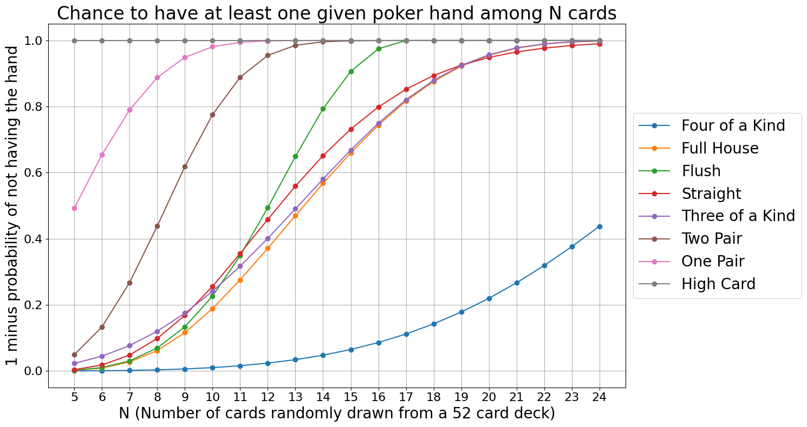
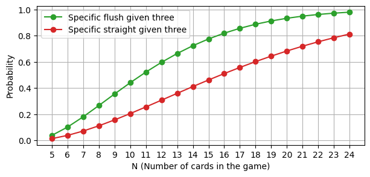

This post is about a card game my friend Neel Alex invented, which many of our friends and families now like a lot. The game is similar to [liar’s dice](https://en.wikipedia.org/wiki/Liar%27s_dice) and [bullshit](https://en.wikipedia.org/wiki/Cheat_(game)), and uses [poker hands](https://en.wikipedia.org/wiki/List_of_poker_hands#Hand-ranking_categories). The game is fast-paced and very fun: you get to bluff and guess and mess with other people’s guesses.

## Rules
Each player starts with one card. A round starts with someone naming a poker combination (e.g. “high card king” or “pair of tens”). With the turn rotating clockwise, each next player has a choice:
1. **Raise the stakes:** name a higher poker combination than the one named by the previous player (e.g. “pair of queens”) that they believe is present in the combined cards of all players.
2. **Call bullshit** on the previous player’s combination. When someone calls bullshit, all players reveal their cards and the presence of the contested poker hand is verified. If the hand is present, the player who called bullshit loses the round; else, the player who named this poker hand loses. The loser starts all subsequent rounds with one extra card, and names the first combination in the next round. (This makes the game self-balancing, as losing gives an advantage: more cards = more information.) However, if someone loses when they have 5 cards, they are kicked from the game.

The last person remaining in the game is the winner. 

Liar’s poker is played with Flush and Straight swapped in the standard poker hand ordering (see below why), and without wildcards (e.g. Jokers).

**Alt rule: anyone can call bullshit.** Usually you don't want to do this if it's not your turn coming up (since there will be a higher combination coming before your turn that might be easier to call out), but sometimes you just *know* someone is lying and think that it's possible that the rest of the table can assemble a true higher call, in which case you want to call BS earlier.

## Example round
Let's say Anna, Ben, and Connor are playing. Anna and Ben each have 2 cards, while Connor has 1 card. Here are their hands:

- Anna: 8♣, Q♠
- Ben: 8♦, J♥
- Connor: 9♠

Anna starts the round:
Anna: "High card Eight." Ben: (thinking that Anna probably does in fact have an eight) "Pair of Eights." Connor: (knowing he doesn't have an extra nine as he only has one card, but hoping someone else might) "Pair of Nines." Anna: (realizing she doesn't have a nine and doubting Ben does, and also doubting someone else will have another Queen for her to raise to Pair of Queens) "I call bullshit."

All players reveal their cards. Since there isn't actually a pair of nines, Connor loses this round. He now starts the next round with 2 cards instead of 1, while Anna and Ben remain at 2 cards each.

This example shows how players might choose to bluff based on their knowledge of their own cards and their guesses about others' hands, and how a player might decide to call bullshit when they believe a claim is unlikely to be true.

## Why reverse the relative ordering of Straight and Flush?
**TLDR:** more cards are in play and can be used to assemble poker combinations compared to hold-em poker (up to 5 times the number of players VS 7 fixed), which changes the dynamic.

<!-- 

  
Expand for a more detailed explanation.
 -->

We want for more common and easier-to-guess combinations to be ranked lower. In the [traditional poker hand ranking](https://en.wikipedia.org/wiki/List_of_poker_hands#Hand-ranking_categories), Flush is valued more than Straight. However, in Liar's Poker, Flush is both more common and is easier to guess than Straight:

1. Flush is similarly or more likely than Straight when the number of cards in the game (for all players together) is 11 or higher, which happens to be roughly when it might start getting called (see the plot below).

    

2. Flush is easier to guess than Straight:
    - Flush: say I have 3 cards of a given suit, and no other cards. To get Flush, I need to bet that the other players have any 2 of the 10 remaining cards of that suit. 
    - Straight: suppose I have 3 of the required ranks, and bet that the other players have at least one of the 4 cards for each of the two ranks I’m missing.
    
    Below is a plot of the chance of our bets being correct depending on the total number of cards in the game. As you can see, it is a good bit more likely that a bet on Flush would work out, compared to a bet on Straight — for any number of cards in play.

    

You can find the code for the plots [here](https://gist.github.com/krasheninnikov/aa5baf939a9563075a70c0342a4fe5ea#file-poker_hand_probabilities-ipynb).

<!-- 
 -->

*Thanks to Neel Alex and Claude 3.5 Sonnet for feedback on this post.*