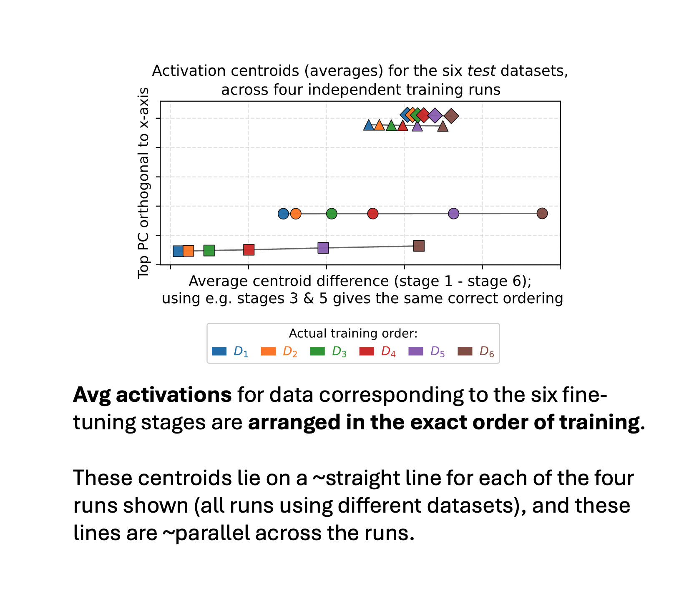
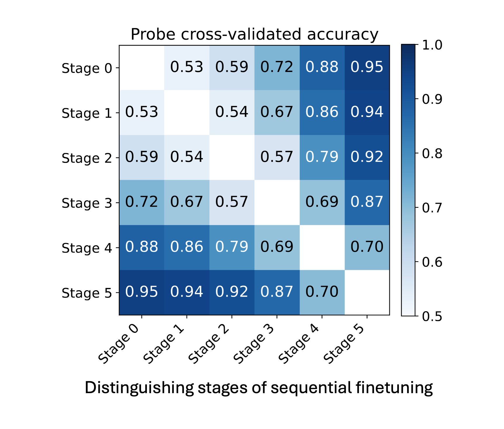
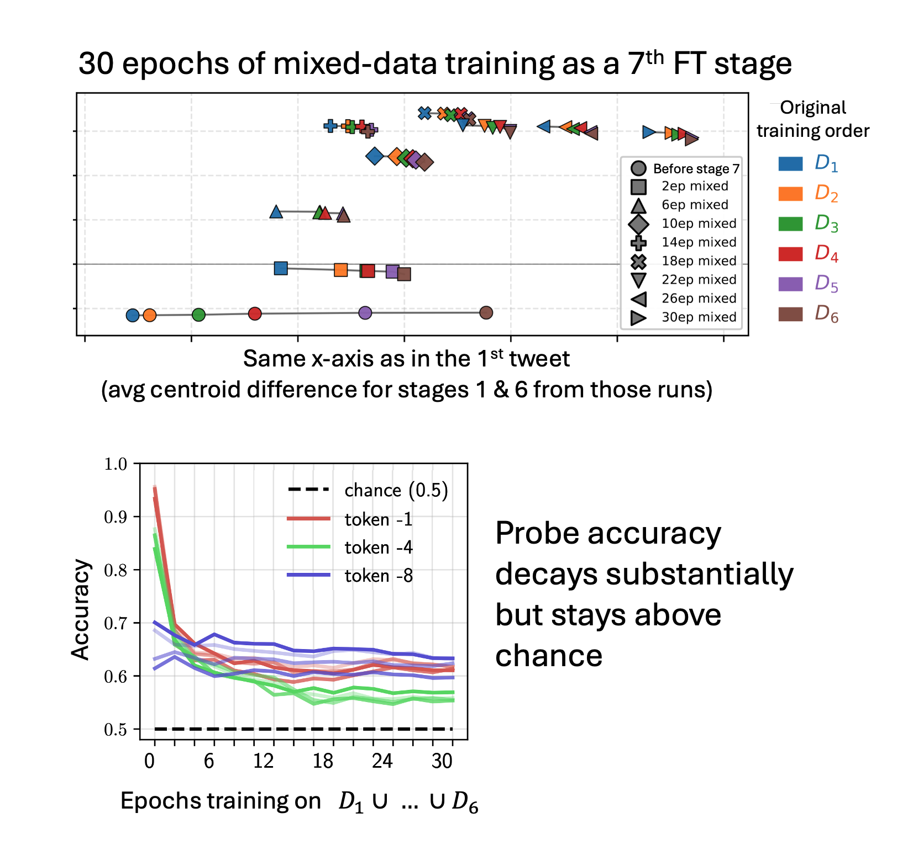

Reposting the [twitter thread](https://x.com/dmkrash/status/1971250157598728658) about our recent [paper](https://arxiv.org/abs/2509.14223) with Rich Turner and David Krueger.

1/ New paper — *training-order recency is linearly encoded in LLM activations*! We sequentially finetuned a model on 6 datasets w/ disjoint entities. Avg activations of the 6 corresponding test sets line up in exact training order! AND lines for diff training runs are ~parallel!

2/ Linear probes can distinguish info that appeared "early" from "late" in training with >90% accuracy, even on entities never seen during probe training. Data from nearby training stages is harder to distinguish than data from stages further apart.

3/ The signal is so strong it persists even after 30 epochs of additional training on data from all stages together — even though there's no training signal to maintain the training-order distinction anymore!

4/ This connects to and extends beyond "[Do I know this entity?](https://arxiv.org/abs/2411.14257)" work from Ferrando et al. They showed models can detect WHETHER they've seen something (binary). We show models encode WHEN they saw it (continuous) — centroids for all 6 stages line up in the right order!

5/ We show models can also directly access this training-order info when trained to do so. We finetuned them to answer "Which training stage is [alias] from?" → 80% accuracy on entities unseen in this finetune. If the training loss rewards using this info, models will do so.

6/ Is this training-order recency encoding attributable to some easily measurable statistics (e.g. activation magnitudes, or some kind of model confidence)? We tested many simple stats like this but couldn’t fully explain the effect.

7/ Speculating re implications: could LLMs use this to detect and resist effects of recent training (e.g. beliefs inserted with Synth Document Finetuning, or just FT’d behavior changes)? In principle this could occur at either test or training time, and enable “alignment faking”.

8/ A very early version of this work was the best paper runner-up at the MemFM workshop at ICML 2025! Very grateful to the organizers and the reviewers.